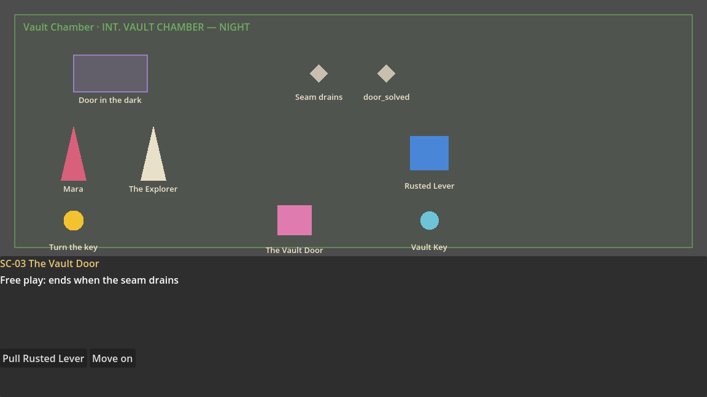

# Engine adapters

VC Game Studio hands a project to a game engine through an **adapter**. Godot 4
is the first; Unity 6, Unreal Engine 5 and a custom JSON engine are registered
and shown as "coming later" on the handoff screen.

Code is generated from the story and is never the source of truth (HANDOFF):
every export rewrites the generated folder. The one exception is each
generated script's **custom code** region (below): code written there is
the person's own, and survives every export.

## Custom code, and the review before sending

Each generated script ends with a region of its own, between two marker
lines under a note:

```gdscript
# Your own code goes between these two lines: VC Game Studio keeps it when it exports again.
# BEGIN CUSTOM: code
static func my_helper() -> int:
	return 7
# END CUSTOM: code
```

- **Godot:** every generated `.gd` (scene flows, choices, the story graph,
  the dialogue table, objects, rules, levels), at the end of the class: add
  variables, functions, or overrides of the runtime's hooks.
- **Unity:** `StoryKeys.cs`, inside `VCGS.Keys`; its key classes are
  `partial`, so they can also be extended from a file of your own.
- **Unreal:** `VcgsStoryKeys.h`, inside `VcgsKeys`; and the end of
  `import_datatables.py` and `build_level.py`, run after the script.

Exporting again writes each file afresh with the region's code carried over
from the file already there (matched by the region's name). Code from a
region the new file no longer has goes into its first region, marked; a file
with no region at all can't take it, and the review says so. The markers use
`#` or `//`, whatever the language comments with.

**The review.** Sending to a folder that already holds an export (the desktop
app's project folder, or a folder picked in a browser that allows it, such as
Chrome or Edge) first reads what is there. When anything there would change,
a review lists each file that changes (new, or its lines added and removed),
whether its custom code is kept, and a diff of any file clicked; nothing is
written until **Send**. A generated file changed in the engine *outside* its
custom region since the last export is flagged in the review: keep the
engine's version (it is left alone, and pointed out again next time) or
overwrite it. Edits inside the regions never count as changes. The checks
test this in each engine: `check-godot.sh`, `check-unity.sh` and
`check-unreal.sh` export, write custom code into a region (a function in
Godot, a key in a partial class in Unity, a constant in Unreal), export
again over it, and use that code.

## How it fits together

```
Project (story model)
   │  buildIR()                apps/studio/src/renderer/model/handoff/ir.ts
   ▼
HandoffIR (engine-neutral: scenes + timelines, characters, objects with
   │       states and interactions, flags, triggers, gates, choices,
   │       dialogue, story graph, arcs; stable snake_case / PascalCase names)
   │  adapter.generate(ir, outputPath)
   ▼
EngineOutput { files, elements }   one row per element: what it generates,
                                   its files, and a fingerprint
```

- `handoff/engines.ts`: the `EngineAdapter` interface and `fingerprint()`.
- `handoff/index.ts`: the registry (`ENGINES`), the target (`EngineTarget`),
  `planHandoff()` (statuses: Ready / Changed / Issue against the last export)
  and `recordExport()`.
- `handoff/godot.ts`: the Godot 4 adapter.
- `handoff/zip.ts`: the browser download.
- `src/main/handoff.ts`: the desktop app's folder picker and file writer (it
  refuses any path outside the chosen folder).

## Adding an engine

1. Write `handoff/<engine>.ts` exporting an `EngineAdapter` with `available:
   true` and a `generate(ir, outputPath)` that returns files and one
   `ElementOutput` per element. Fingerprint each element from the IR data it
   uses, prefixed with an adapter version, so a change in the generator marks
   everything Changed.
2. Replace its placeholder in `ENGINES` (`handoff/index.ts`).
3. Add tests like `model/__tests__/handoff.test.ts`, and a real-engine check
   like `scripts/check-godot.sh` if the engine can run headless.

Nothing in the story model, the Bible or the handoff screen changes.

## Design definitions

Lore entries, quests, mechanics and encounters (often sorted out of raw notes;
see [NOTE-SORTER.md](NOTE-SORTER.md)) go to every engine as data: the IR's
`lore`, `quests`, `mechanics` and `encounters`, each with its key, code, name,
description and other fields. They are for the game to read, such as a codex, a
quest log or tuning. All four also play in every runtime, the same way as in
the studio's play-through:

- **Lore** is discovered when its *Discovered when* rule holds (known from a
  new game when it's empty). The game state keeps the codex in the order the
  player found things: Godot `known_lore()` and `lore_discovered`, with the
  name and text in `VCGSRules.LORE`; Unity `KnownLore`, `LoreDiscovered` and
  `Story.LoreEntry`; Unreal `GetKnownLore`, `OnLoreDiscovered` and
  `GetLoreEntry`.
- **Mechanics** become available when their *Available when* rule holds (from
  a new game when it's empty), so a system can switch on with the story:
  Godot `has_mechanic()` and `mechanic_available`; Unity `HasMechanic` and
  `MechanicAvailable`; Unreal `HasMechanic` and `OnMechanicAvailable`. A
  mechanic's fields, such as its tuning, are read with
  `VCGSRules.mechanic_detail(key, "tuning")`, `Story.MechanicDetail` or
  `GetMechanicDetail`.

- **Quests** start when their *Starts when* rule holds (at once, on a new game,
  when it's empty) and complete when their *Complete when* rule holds, paying
  their reward. The game state keeps each one's state (`quest_state` /
  `QuestState` / `GetQuestState`) and says when one starts or completes
  (Godot `quest_started`, `quest_completed`; Unity `QuestStarted`,
  `QuestCompleted`; Unreal `OnQuestStarted`, `OnQuestCompleted` on
  `UVcgsSubsystem`).
- **Encounters** on a timeline ask the game to play them: Godot
  `encounter_requested(key, can_win)`, Unity `EncounterRequested`, Unreal
  `OnEncounter`. The game plays the fight and then calls `win()` / `Win()`
  (refused while the *Can be won when* rule doesn't hold) or `lose()` /
  `Lose()`. A loss does its effects, then plays the encounter again, ends the
  game (`game_over` / `GameOver` / `OnGameOver`), or carries on through the
  scene. Godot's placeholder scenes stand in for the fight with Win and Lose
  buttons, and have a codex: press C, or the Codex button (which counts what's
  new), for the quest log (quests under way with their goals, then those done),
  the characters met (anyone with a *Codex entry* in the Bible, once they have
  spoken a line), the locations visited (any location with a *Codex entry*,
  once a scene set there has played), the items found (any item with a *Codex entry*, once the
  player has held it, marked while carried, and equipped with its slot:
  "(carried, equipped · Hand)"; Godot `game.slot_of`, Unity and Unreal `SlotOf`), the objects used (any object
  with a *Codex entry*, once the player has used it, with its state now), the
  mechanics available (their controls and description), the skills learned
  (in the order first learned: rank, kind and tree, what they do; each rank
  is news, from `skill_learned` / `SkillLearned` / `OnSkillLearned`, and
  Unreal keeps the order in `SkillOrder`), the encounters
  met (their enemies and weakness, and whether they were won) and the lore
  found so far, in the order found, with its text. The game state keeps the
  encounters met in order: Godot `met_encounters()` with `encounter_met` and
  `encounter_won`; Unity `MetEncounters`, `EncounterMet` and `EncounterWon`;
  Unreal `GetMetEncounters`, `OnEncounterMet` and `OnEncounterWon`. The
  characters met the same way: Godot `met_characters()` and `character_met`
  (entries in `VCGSRules.CHARACTERS`); Unity `MetCharacters`, `CharacterMet`
  and `Story.CharacterCodex`; Unreal `GetMetCharacters` and `OnCharacterMet`.
  And the items found: Godot `items_found()` and `item_found` (entries in
  `VCGSRules.ITEMS`); Unity `FoundItems`, `ItemFound` and `Story.ItemCodex`;
  Unreal `GetFoundItems` and `OnItemFound`. And the locations visited: Godot
  `visited_locations()` and `location_visited` (entries in
  `VCGSRules.LOCATIONS`); Unity `VisitedLocations`, `LocationVisited` and
  `Story.LocationCodex`; Unreal `GetVisitedLocations` and `OnLocationVisited`.
  Each scene says where it is set (`location` in the IR). And the objects
  used: Godot `objects_used()` and `object_used` (entries in
  `VCGSRules.OBJECT_ENTRIES`); Unity `UsedObjects`, `ObjectUsed` and
  `Story.ObjectCodex`; Unreal `GetUsedObjects` and `OnObjectUsed`.
  Unity has the
  same codex as `Codex` (plain C#) and a `VcgsCodex` screen to put next to
  `VcgsGame`; Unreal as `vcgs::Codex`, `GetCodexText` / `GetCodexNewCount` on
  the subsystem and an `AVcgsCodexHUD` to set as the game mode's HUD. C opens
  each. Each codex searches: with a search, only the entries that
  have it (ignoring case), in the sections that have any, and "Nothing matches"
  when none do. Godot's screen has a search box (/ to type in it;
  `codex_text(query)`, `set_codex_search`); Unity's too (`Codex.Text(query)`,
  `VcgsCodex.Search`); Unreal's HUD takes / then typed letters, digits and
  spaces (Enter stops, Escape clears; `GetCodexText(Search)`,
  `SetCodexSearch`). Each also filters by section ("quests", "characters",
  "locations", "items", "objects", "mechanics", "encounters", "lore"; only
  those the story has): Godot's screen has a row of buttons and Tab
  (`codex_text(query, section)`, `set_codex_section`, `codex_section_keys()`);
  Unity's a toolbar and Tab (`Codex.Text(query, section)`, `Codex.SectionKeys`,
  `VcgsCodex.Section`); Unreal's HUD Tab (`GetCodexText(Search, Section)`,
  `GetCodexSections`, `SetCodexSection`). And each sorts every section:
  "found" (the order found, the default), "newest" (newest first) or "name"
  (A–Z, ignoring case), quests under way still before those done. Godot has a
  sort menu and S (`codex_text(query, section, sort)`, `set_codex_sort`);
  Unity sort buttons and S (`Codex.Text(query, section, sort)`,
  `VcgsCodex.Sort`); Unreal's HUD S (`GetCodexText(Search, Section, Sort)`,
  `SetCodexSort`). And each keeps bookmarks in the game state, by entry key
  ("lore:the_drowned_order"): a bookmarked entry ends its first line with ★,
  and the section "bookmarks" shows only them (or "No bookmarks yet."). The
  placeholder screens have a cursor (▶, the arrow keys) and B to bookmark the
  entry it is on. Godot `toggle_bookmark`, `is_bookmarked` on the game state,
  `move_codex_cursor` and `toggle_codex_bookmark` on the screen; Unity
  `GameState.ToggleBookmark`, `Codex.EntryKeys`, `VcgsCodex.MoveCursor` and
  `ToggleBookmark`; Unreal `ToggleCodexBookmark`, `IsCodexBookmarked` and
  `GetCodexEntries` on the subsystem. Notes the same way: the player's note on
  an entry ends it ("Note: …"), a search looks in the notes too, and N on the
  placeholder screens writes one on the cursor entry (Enter keeps it, Escape
  leaves it). Godot `set_note` / `note_for` on the game state and
  `edit_codex_note` / `set_codex_note` on the screen; Unity
  `GameState.SetNote` / `NoteFor` and `VcgsCodex.EditNote` / `KeepNote`;
  Unreal `SetCodexNote` / `GetCodexNote` on the subsystem. The notes export
  (E on the placeholder screens) writes the same text as the studio's: Godot
  `codex_notes_text()` / `export_codex_notes()` (user://codex_notes.txt);
  Unity `Codex.NotesText` / `VcgsCodex.ExportNotes` (persistentDataPath);
  Unreal `GetCodexNotesText` / `ExportCodexNotes` (Saved/CodexNotes.txt).
  And I reads such a file back, from any of them or the studio, matching each
  note to an entry by section and name (states and a quest's goal aside):
  Godot `codex_notes_from()` / `import_codex_notes()`; Unity
  `Codex.NotesFrom` / `ImportNotes` and `VcgsCodex.ImportNotes`; Unreal
  `ImportCodexNotes` / `ImportCodexNotesText` (with the headings it could not
  match). To share them, Y copies the notes to the clipboard and V takes in
  notes someone shared from it: Godot `share_codex_notes()` /
  `paste_codex_notes()` (and `take_codex_notes(text)`); Unity
  `VcgsCodex.ShareNotes` / `PasteNotes`; Unreal `CopyCodexNotes` /
  `PasteCodexNotes` (the plugin now uses the ApplicationCore module for the
  clipboard). M emails them: the same mail link as the studio's (subject
  "<story> codex notes", the notes as the body), opened in the player's mail
  app; notes too long for a link (over 2000 characters) go on the clipboard
  and the mail says to paste them: Godot `email_codex_notes()` and
  `codex_notes_mailto()`; Unity `VcgsCodex.EmailNotes()` and
  `Codex.NotesMailto()`; Unreal `EmailCodexNotes` and
  `vcgs::Codex::NotesMailto()`. T texts them: the same text-message link as
  the studio's (`sms:?&body=` and the notes), opened in the messages app,
  with the same clipboard fallback: Godot `text_codex_notes()` and
  `codex_notes_sms()`; Unity `VcgsCodex.TextNotes()` and `Codex.NotesSms()`;
  Unreal `TextCodexNotes` and `vcgs::Codex::NotesSms()`. P prints them: the same page as the studio prints (the story's
  name, then each section's notes), saved as an HTML file and opened in the
  browser to print from: Godot `print_codex_notes()` (user://codex_notes.html)
  and `codex_notes_page()`; Unity `VcgsCodex.PrintNotes()` (persistentDataPath)
  and `Codex.NotesPage()`; Unreal `PrintCodexNotes` (Saved/CodexNotes.html)
  and `vcgs::Codex::NotesPage()`. And the notes **sync** through a sync file (JSON,
  `"format": "vcgs-codex-notes-sync"`): every note with when it was last
  changed (a note taken off kept, empty), merged so that for each entry the
  newer note wins, and written back. The placeholder screens sync when the
  codex opens, every few seconds while it is open, and after each note; put
  the file in a folder that syncs (a cloud drive, Steam Cloud) and the notes
  follow the player across devices. Godot `sync_codex_notes()` and
  `codex_sync_path` (user://codex_notes_sync.json), `sync_notes` /
  `notes_sync_text` on the game state; Unity `VcgsCodex.SyncNotes()` and
  `SyncPath` (persistentDataPath), `GameState.SyncNotes` / `NotesSyncText`;
  Unreal `SyncCodexNotes` (Saved/CodexNotesSync.json). Entries are named by
  their keys, so a game's copies sync with each other (not with the studio's
  preview, which names them differently).
- **Conditions** can ask about all three, anywhere a rule goes (a gate, a
  choice, a trigger, an encounter's win): a quest *is done*, *is not done*, *is
  under way* or *has not started*; lore *is known* or *is not known*; a mechanic
  *is available* or *is not available*. They reach the engines as plain
  conditions (`{ "kind": "quest", "ref": "open_the_vault", "op": "done" }`),
  checked by every runtime's rule engine. In the sample the eels can only be
  beaten once Lantern oil is available.
- **Effects** can start a quest (*Start quest*: a quest under way or done stays
  as it is), complete one (*Complete quest*: done at once, started or not, and
  its reward paid once), reveal lore (*Reveal lore*) and make a mechanic
  available (*Make mechanic available*), wherever effects go: a trigger, a
  choice's option, a timeline event, a route, a puzzle's or quest's reward. They
  reach the engines as `startQuest`, `completeQuest`, `revealLore` and
  `enableMechanic` effects, and raise the same events as the rules do. A quest,
  lore entry or mechanic set *Only by an effect* carries `byEffect: true` and
  no rule of its own: the runtimes wait for the effect.

## The Godot 4 adapter

- **Runtime** (`addons/vcgs_runtime/`, the same for every project):
  `game_state.gd` (the GameState autoload), `scene_flow.gd` (plays a scene's
  timeline and emits a signal for each event), `interactable.gd`,
  `rule_engine.gd` (conditions and effects), and
  Resource classes for characters, items, locations, cinematics and puzzles,
  and for the design definitions (`VCGSLore`, `VCGSQuest`, `VCGSMechanic`,
  `VCGSEncounter`).
- **Generated** (`res://vcgs/generated/` by default): a flow controller per
  scene, a `.tres` per character / item / location / cinematic / puzzle and
  per lore entry / quest / mechanic / encounter (`lore/`, `quests/`,
  `mechanics/`, `encounters/`), an
  interactable script per object, `logic/rules.gd` (flags, triggers, gates),
  a script per choice, the dialogue table, the story graph, a VO cue list
  (under a `.gdignore`), a README and a manifest.
- **Conditions and effects** are structured rules in VC Game Studio, never
  code. The IR carries them as plain data with engine keys:
  `{ "match": "all", "items": [{ "kind": "flag", "ref": "door_solved", "op": "is", "value": "yes" }] }`
  and effects such as `{ "kind": "take", "ref": "vault_key" }`. Condition
  kinds are flag, item, object, choice, arc, puzzle and visited; effect kinds
  are setFlag, give, take, setObject, arc, solve and fire. An adapter only
  has to read them: in Godot, `rule_engine.gd` checks and applies them;
  triggers fire and puzzles solve themselves after each GameState change;
  events whose `when` fails are skipped; a free play ends when its `ends`
  rule holds; choices and scene exits offer only what their conditions allow.
  The words a writer typed beside a rule travel too, as documentation.
- **Placeholder scenes** (on by default; *Placeholder scenes* on the handoff
  screen): a `scenes/<scene>.tscn` per story scene holding its flow
  controller, a labelled stand-in for the location, characters, objects
  (each wired to its interactable script), items, cinematics, puzzles and
  logic, and a plain on-screen player (`debug_player.gd`). Open one and press
  F6 to play it; `play_story.tscn` plays the story from its Beginning, scene
  after scene, choices on the graph included. They are rewritten on each
  export: build the real scene as an inherited scene saved elsewhere.

  
- **Checked against Godot 4.3**: `GODOT=/path/to/godot apps/studio/scripts/check-godot.sh`
  exports the sample project and has Godot load every script and resource,
  pull the lever (which fires the trigger, which solves the door, which ends
  the free play) and play the Vault Door scene through its branch; it loads
  every generated .tscn and plays the Vault Door's through its on-screen
  player to the ending. CI runs it.

## The JSON adapter (any engine)

Pick **Any engine (JSON)** on the handoff screen. It writes, under `vcgs/`:

- `story.json`: the whole handoff model (the same IR the Godot adapter reads),
  with `format: "vcgs-story"`, `version: 1` and stable snake_case keys.
- `story.schema.json`: a JSON Schema (2020-12) for it. The sample's
  `story.json` validates against it with Ajv in strict mode (with union types
  allowed, which the schema uses for nullable fields).
- `README.md`: how to play it: where the story starts, how nodes, scenes,
  choices and options move on, how triggers and puzzles settle, and every
  condition and effect kind.

## The Unity adapter

Pick **Unity 6**. The runtime goes to `Assets/VCGS/Runtime` (an assembly
definition, `VCGS.Runtime`), the story to `Assets/VCGS/Generated`:

- **Runtime, plain C#** (so it runs and is tested outside Unity too): `Story`
  (reads `story.json`), `GameState` (flags, items, arcs, choices, puzzles,
  visits, picks; triggers and puzzles settle after each change), `Rules`
  (conditions, effects, gates, option offers), `ScenePlayer` (a scene's
  timeline, with the same events as the Godot scene flow), `Interactions`
  and `StoryWalker` (routes and choices on the graph).
- **Runtime, Unity wrappers**: `VcgsGame` (the one playthrough; give it
  `story.json`), `VcgsSceneFlow` (a scene key and a `ScenePlayer`),
  `VcgsInteractable` (an object key), and ScriptableObject classes
  `VcgsCharacter`, `VcgsItem`, `VcgsLocation`, `VcgsCinematic` (with its shot
  list), `VcgsLore`, `VcgsQuest`, `VcgsMechanic` and `VcgsEncounter`, one class
  per file as Unity requires.
- **Generated**: `story.json` (the same handoff model as the JSON adapter),
  `StoryKeys.cs` (`VCGS.Keys.Scenes.Sc03TheVaultDoor` and every other key, for
  game code), and a ScriptableObject `.asset` per character, item, location,
  cinematic, lore entry, quest, mechanic and encounter.
- **Every file has a `.meta`** whose GUID comes from its path, so assets keep
  their script references and your references to them survive re-exports.
- **Checked with .NET**: `apps/studio/scripts/check-unity.sh` exports the
  sample, compiles the runtime and keys as C# 9 with warnings as errors against
  stubs of UnityEngine, and plays the Vault Door scene and the graph to the
  ending. CI runs it. It has not been opened in the Unity editor here.

## The Unreal adapter

Pick **Unreal Engine 5**. It writes a plugin and the story's data:

- **`Plugins/VCGS`** (the same for every project): `VcgsCore.h`, the story's
  logic in portable C++17 (standard library only, no exceptions or RTTI, as
  Unreal builds): story.json reader, `GameState`, `Rules`, `ScenePlayer`,
  `Interactions`, `StoryWalker`, matching the Godot and Unity runtimes. Around
  it: `UVcgsSubsystem` (a game-instance subsystem holding the playthrough,
  every query Blueprint-callable), `UVcgsSceneFlowComponent` (a scene key and
  Blueprint events: `OnDialogue`, `OnCinematic`, `OnFreePlay`, `OnChoice`,
  `OnFinished`; `Advance`, `Choose`), `UVcgsInteractableComponent`, and
  DataTable row structs.
- **Generated**: `Content/VCGS/Generated/story.json`,
  `Plugins/VCGS/Source/VCGS/Public/Generated/VcgsStoryKeys.h`
  (`VcgsKeys::Scenes::Sc03TheVaultDoor` and every other key), DataTable CSVs
  (characters, items, locations, cinematics, shots, lines, lore, quests,
  mechanics, encounters) and
  `import_datatables.py`, which imports them in the editor as DT_ assets.
- `story.json` is read at runtime, so add `VCGS/Generated` to *Additional
  Non-Asset Directories to Package*.
- **Checked here without Unreal**: `apps/studio/scripts/check-unreal.sh` builds
  and runs a program that plays the sample with the core (gcc and clang; it
  also runs clean under gcc's address and undefined-behaviour sanitizers),
  compiles every plugin source against stubs of Unreal's headers, byte-compiles
  the import script and compiles `VCGS.Build.cs`. CI runs it. Unreal Header
  Tool and the editor have not run on it.

**Dual dialogue.** A dialogue event whose line is dual carries `dual`, the
line it is spoken at the same time as: the line directly before it in the
script, the last part of the speech it is set beside. When a runtime reaches
a dialogue event and the next event on the track is its partner (either way
round) and may be spoken, the two play as one beat: the left-hand speech
first, both effects applied, and one `Advance()` for the pair. A game starts
both voices from a hook of its own, asked instead of the single-line one —
Godot `VCGSSceneFlow.dual_requested(line_id, with_line_id)`, Unity
`ScenePlayer.DualRequested`, Unreal `vcgs::ScenePlayer::OnDual` and the
component's Blueprint event `OnDualDialogue` (both lines' speaker, text and
direction). The Play-through preview pairs lines by the same rule.

## Skills and upgrades

The IR's `skills` (spec §8) are the skills, abilities and upgrades: each has
its `ranks`, a `cost` (an item's key and name, and an amount, or null), what
it `requires` first (skill keys), `learnWhen` (and `learnWhenText`, the rule
in words) and `onLearn`, with its kind, tree and use in `fields`. Every
runtime keeps each skill's rank, checks and learns it the same way, and
refuses with the studio's own words ("Learn Deep Breath first.", "Costs 2 ×
Salvage (you have 0)."). Conditions of kind `skill` (`atLeast` / `below` a
rank) and the `learnSkill` effect (a rank, free, up to `ranks`) work
everywhere, and a save keeps the ranks (`skills`, by key).

| Engine | Learn | Rank | Why not | Signal |
| --- | --- | --- | --- | --- |
| Godot | `VCGSRules.learn(key, game)` | `game.skill_rank(key)` | `VCGSRules.learn_check` | `skill_learned` |
| Unity | `Rules.Learn(key, game)` | `game.SkillRank(key)` | `Rules.LearnCheck` | `SkillLearned` |
| Unreal | `UVcgsSubsystem::LearnSkill` (`vcgs::Rules::Learn`) | `GetSkillRank` | `GetSkillLearnCheck` | `OnSkillLearned` |

Each skill also gets its data like the other design definitions: a
`VCGSSkill` resource (Godot), a `VcgsSkill` asset (Unity), a `DT_Skills` row
(Unreal), and a `Skills` key class. Each engine's check learns the sample's
Diving tree through every refusal, pays with the eels' salvage, and saves and
loads the ranks.

## Weapons and equipment

The IR's `equipment` lists the items that can be equipped (spec §8), by item
key: `slot`, `stats` (names and values), `ammo` (an item key and name, or
null) and `ammoPerUse`, and `durability` (uses before it breaks; 0 never).
Every runtime keeps what is in each slot and each item's wear, equips only
what is carried (putting back what was in the slot), spends ammunition and
wear on each use, breaks a worn-out item (one is taken, the next starts
unworn), takes an item out of its slot once none is carried, adds up stats by
name, and refuses in the studio's words ("You don't carry Diving Knife.",
"Out of Flare."). The `equipped` condition and the `equip` / `unequip` effects
work everywhere, and a save keeps `equipped` (slot to item) and `wear`. A
`stat` condition (`{ "kind": "stat", "ref": "Damage", "op": "atLeast" |
"below", "value": 2 }`) names a stat rather than a key and compares what the
equipped items add up to (the same `stat` total, name in any case, 0 when
nothing equipped has it); the IR keeps the name as written.

| Engine | Equip / put away / use | Slot, stat, wear | Signals |
| --- | --- | --- | --- |
| Godot | `VCGSRules.equip`, `unequip`, `use_item` (and `equip_check`, `use_check`) | `game.equipped_in(slot)`, `VCGSRules.stat(name, game)`, `uses_left` | `item_equipped`, `item_unequipped`, `item_used`, `item_broke` |
| Unity | `game.Equip`, `Unequip`, `UseItem` (and `EquipCheck`, `UseCheck`) | `EquippedIn`, `Stat`, `UsesLeft` | `ItemEquipped`, `ItemUnequipped`, `ItemUsed`, `ItemBroke` |
| Unreal | `EquipItem`, `UnequipItem`, `UseItem` (and `GetUseCheck`) on the subsystem | `GetEquippedIn`, `GetStat`, `GetUsesLeft` | `OnItemEquipped`, `OnItemUnequipped`, `OnItemUsed`, `OnItemBroke` |

Each engine's check equips the sample's knife and flare pistol, burns the
flare, wears the knife out, equips a new one by an effect, and saves and
loads the slots and wear.

## Crafting

The IR's `recipes` list the items that can be crafted (spec §8), by item key:
`makes`, the `ingredients` (item key, name and amount), and `when` (with
`whenText`, the rule in words). Every runtime checks the rule, then each
ingredient, and says why not in the studio's words ("Needs Flare Pistol is
carried.", "Needs 1 × Salvage (you have 0)."); crafting uses up the
ingredients and gives what it makes (found as any item given is). Godot:
`VCGSRules.craft(key, game)` / `craft_check`, signal `item_crafted`. Unity:
`game.Craft` / `CraftCheck`, event `ItemCrafted`. Unreal: `CraftItem` /
`GetCraftCheck` on the subsystem, `OnItemCrafted`. Each engine's check crafts
the sample's flares.

## Comments and tasks

The IR's `notes` are the project's open comments and tasks (spec §16), oldest
first. Each has its kind, text, author, a task's role, replies, and `on`: what
it is about, in engine terms (a story key and identifier, a branch's keys, a
level or item's GUID and export name, or a generated file's path). Every
adapter writes `TASKS.md` from them (`notes.ts`, `tasksMarkdown`). It also
puts TODO(VCGS) lines beside the thing itself: in Unity's `StoryKeys.cs` and
Unreal's `VcgsStoryKeys.h` above the key constant, in Godot at the top of the
level's script, and for a comment on a file at the top of that file
(`withCodeNotes`). The JSON adapter keeps them in `story.json`. Story data and
row fingerprints are made without the notes (`withoutNotes`), so a comment
never marks the story as changed. See [COLLABORATION.md](COLLABORATION.md).

## Saved games

Every runtime saves and loads the game in one format, so a save from one
engine loads in another: a JSON file with `"format": "vcgs-save"`, the story's
name, `at` (the scene key to play on from, "" for the story's beginning),
`saved_at`, and everything the story knows: `flags`, `objects`, `items`,
`arcs` and `chosen` by key, `quests` in the order they started (`{key,
state}`), `solved`, `visited`, `fired`, `picked` and `won` as lists, and the
codex's ordered lists `met`, `characters`, `found`, `locations`, `used`,
`lore` and `mechanics`. The codex notes and bookmarks are the player's own and
stay out of it (the notes sync by themselves).

A save holds the game **as the scene being played began**: each scene player
takes a checkpoint as it starts, before it marks the scene visited. Loading
puts that back and plays the scene again from its start, so nothing in it is
counted twice. Anything the story gained since the save starts where it
starts. The placeholder screens save with **F5** and load with **F9**:

- Godot: `save_game()` / `load_game()` on the debug player
  (user://savegame.json), which opens the scene's placeholder scene; on the
  game state `save_text(story)`, `load_text(text)` (the scene key, or null)
  and `checkpoint(scene_key)`, which `VCGSSceneFlow.start()` calls.
- Unity: `VcgsGame.SaveGame()` / `LoadGame()` (savegame.json in
  persistentDataPath); `LoadGame` returns the scene key and raises
  `GameLoaded`, for your game to open the Unity scene that plays it. The codex
  screen's F5 and F9 call them. `GameState.SaveText`, `LoadSave` and
  `Checkpoint`, which `ScenePlayer.Start()` calls.
- Unreal: `SaveGame` / `LoadGame` on the subsystem (Saved/SaveGame.json), with
  the scene in `LoadGame`'s Scene and `OnGameLoaded`; the codex HUD's F5 and F9
  call them. `vcgs::GameState::SaveText`, `LoadSave` and `Checkpoint`, which
  `vcgs::ScenePlayer::Start()` calls.

The studio's play-through saves are its own (the whole transcript, by the
studio's ids); see PLAY-THROUGH.md.

## Levels

`buildIR` carries the Level Designer's levels as `levels`
(`model/handoff/levels.ts`), in metres with y up (x east, z south). Each item
has:
- its GUID, export name, position, turn (degrees counter-clockwise from above),
  size and effective parameters
- its story links and rules, with story keys
- its final asset and whether that is locked
- its graybox pieces in its own frame (from `meshesFor`)
- a revision

Each adapter maps the axes:

| Engine | Position | Turn |
| --- | --- | --- |
| Godot | (x, y, z) | turn about +Y |
| Unity | (x, y, −z) | yaw −turn |
| Unreal | (−z, x, y) × 100 cm | yaw −turn |

The level's `light` is the player's light from the player start (`source`, a
story item or mechanic key; `fuel` in seconds, 0 for ever; `range` in metres),
or null. An item in a darkness zone that needs light lists the zones' GUIDs in
`in_dark`; the runtimes block using it while any of them is present and the
light is off, and a `refuel` action fills the light again.

A freeform space has an `outline`: its corners [x, z] around its position,
clockwise seen from above. A door's `host.wall` is then the outline's wall n,
from corner n to the next. Its floor and ceiling are `slab` pieces: an
`outline` around the piece's centre, raised to `size[1]`, and `triangles` for
the top, each clockwise from above. That winding faces up in Godot and Unity
alike, since both see the same map from above. `slabFaces` gives the closed
solid for collision. Unreal gets both sides of every face, so it shows
whichever way it is wound. A freeform volume's `volume` piece is a slab too;
`slabPrisms` cuts it into one convex prism per triangle, since engine
triggers must be convex.

The export record keeps each item's revision (`levelItems`), so the handoff
can say what changed. It also keeps a hash of each generated file
(`fileHashes`); `engineEdits` uses these to find files changed in the engine
since, and the handoff asks before replacing them. The checks in
`scripts/godot-check`, `scripts/unity-check` and `scripts/unreal-check` build
the sample's level and play its key, door and lever.

